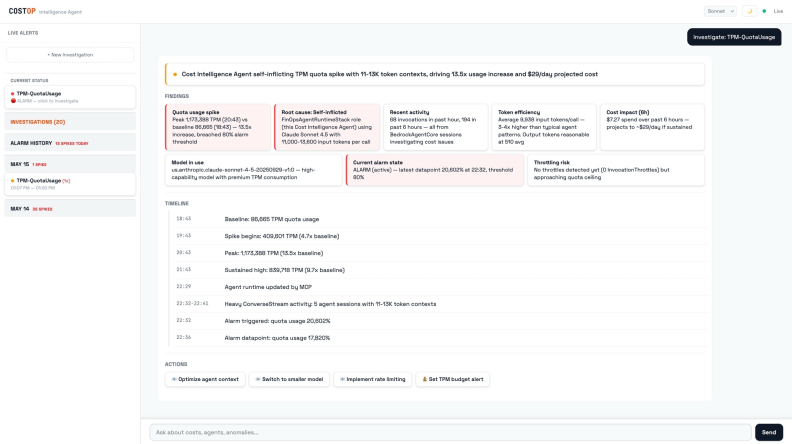

# Cost Intelligence Agent

> Autonomous cost governance, invocation monitoring, and CloudWatch-driven alerting for Amazon Bedrock — powered by prompt-engineered investigation workflows.

Built on Amazon Bedrock AgentCore + Strands SDK + Claude Sonnet 4.6.

> ⚠️ **Important:** Deploy and validate in a **separate test/sandbox account first**. This project is provided **as-is** (see [LICENSE](LICENSE)) with no warranties and no liability — test it thoroughly before relying on it.



---

## 🚀 First Time Setup (5 minutes)

### Prerequisites
- AWS account with Bedrock access (Claude Sonnet 4.6 enabled in your region)
- AWS CLI configured (`aws configure`)

### Step 1: Download the template

```bash
curl -O https://raw.githubusercontent.com/amitml/cost-intelligence-agent/main/cloudformation/costop-template.yaml
```

### Step 2: Deploy

```bash
aws cloudformation create-stack \
  --stack-name CostOp \
  --template-body file://costop-template.yaml \
  --parameters ParameterKey=AdminEmail,ParameterValue=YOUR_EMAIL@company.com \
  --capabilities CAPABILITY_NAMED_IAM \
  --region us-east-1
```

### Step 3: Wait ~5 minutes

```bash
aws cloudformation wait stack-create-complete --stack-name CostOp --region us-east-1
```

### Step 4: Get your URL and login

```bash
aws cloudformation describe-stacks --stack-name CostOp --region us-east-1 \
  --query 'Stacks[0].Outputs[?OutputKey==`WebAppURL`].OutputValue' --output text
```

- Check your email for temporary password from Cognito
- Login with username `admin` and the temp password
- Set a new password when prompted

---

## What It Does

```
Bedrock workload runs → Agent monitors continuously →
Alerts you with: WHO triggered it, WHAT happened, HOW MUCH it cost, and HOW TO FIX
```

### Core Capabilities

| Capability | Description |
|---|---|
| 💰 **Cost Governance** | Per-model and per-agent spend tracking, budget enforcement, anomaly detection |
| 📊 **Invocation Monitoring** | Token usage patterns, throttling events, model call frequency analysis |
| 🚨 **CloudWatch Alerting** | 5 preconfigured alarms with autonomous investigation on trigger |
| 🧠 **Prompt-Engineered Workflows** | Structured hypothesis-driven investigation, evidence ledger, and adaptive response generation |

### Key Features

- **Real-time detection** — CloudWatch alarms monitor Bedrock metrics continuously
- **Autonomous investigation** — prompt-engineered reasoning chains with evidence ledger
- **Structured reports** — findings tiles, timeline, action buttons
- **Pattern memory** — learns from past incidents, recognizes repeats
- **Proactive alerts** — email + Slack with full investigation (not just "alarm fired")
- **Dark mode** — full dark/light theme support

---

## Architecture

```
Web UI (Amplify) → Cognito Auth → AgentCore Runtime (11 tools)
                                        ↓
                    CloudWatch + CloudTrail + Cost Explorer + Invocation Logs
                                        ↓
                    Prompt-engineered investigation → Email + Slack + DynamoDB

Proactive: Alarm → EventBridge → Lambda → Agent → Email/Slack
```

---

## Deploy in a Test Account First

Validate in a **separate test/sandbox account** first:

```bash
aws cloudformation create-stack \
  --stack-name CostOp-test \
  --template-body file://costop-template.yaml \
  --parameters \
    ParameterKey=AdminEmail,ParameterValue=you@company.com \
    ParameterKey=AgentName,ParameterValue=costoptest \
    ParameterKey=MonthlyBudgetLimit,ParameterValue=20 \
  --capabilities CAPABILITY_NAMED_IAM \
  --region us-east-1
```

- Use a distinct **`AgentName`** (e.g. `costoptest`) so the AgentCore runtime/memory names don't collide with another instance in the same account + region.
- Keep a low **`MonthlyBudgetLimit`** while testing.
- Tear down with the [Delete Everything](#delete-everything) steps when done.

Roll out more widely only after verifying alerts, investigations, and model selection behave as expected.

---

## Permissions & Demo Mode (read-only by default)

Out of the box this runs in a **read-only "demo" posture**. The agent can investigate, analyze root cause, and *recommend* actions — the action tiles show what it *could* do — but its IAM role carries an **explicit Deny** on anything that modifies your resources. Preventive/remediation actions therefore fail with **AccessDenied** instead of changing anything.

**Allowed (analyze + the agent's own state):** read/describe across CloudWatch, CloudTrail, Cost Explorer, Config, Lambda, ECS, RDS, etc.; write to its *own* DynamoDB tables (pattern/investigation memory) and SNS alert topic; create a budget; request a quota increase; open a support case; run model inference.

**Blocked by IAM → AccessDenied:** stop/throttle or reconfigure any Lambda or resource, modify the agent/runtime, change CloudWatch alarms, **any IAM change**, and any **delete / terminate / destroy**.

So in demo mode the tool **cannot make changes to your account** — it only reads and analyzes. If you want it to actually perform remediation (e.g., throttle a runaway Lambda), you must **grant the matching permissions on the runtime role (`<StackName>-RuntimeRole`) yourself**, per your own requirements and review. The capability is present; the permission is intentionally withheld.

---

## Configuration Options

Deploy with custom parameters:

```bash
aws cloudformation create-stack \
  --stack-name CostOp \
  --template-body file://costop-template.yaml \
  --parameters \
    ParameterKey=AdminEmail,ParameterValue=you@company.com \
    ParameterKey=DefaultModel,ParameterValue=Haiku4.5 \
    ParameterKey=MonthlyBudgetLimit,ParameterValue=200 \
    ParameterKey=EnableSlack,ParameterValue=Yes \
    ParameterKey=SlackBotToken,ParameterValue=xoxb-... \
    ParameterKey=MemoryRetentionDays,ParameterValue=90 \
  --capabilities CAPABILITY_NAMED_IAM \
  --region us-east-1
```

### Custom Model

Use any Bedrock model by setting `CustomModelId`:

```bash
ParameterKey=CustomModelId,ParameterValue=us.anthropic.claude-sonnet-4-20250514-v1:0
```

See [cloudformation/README.md](cloudformation/README.md) for all parameters.

---

## Model Selection

Choose the model per request from the in-app **dropdown** (top-right) — e.g. Sonnet 4.6, Haiku 4.5, Sonnet 5. Each answer shows the exact model that produced it.

The choices come from the **`ModelCatalog`** stack parameter — a JSON map of `dropdown key → Bedrock model/inference-profile ID`. Add or repoint models **without rebuilding the image**; just update the parameter.

Default:
```json
{"sonnet":"us.anthropic.claude-sonnet-4-6","haiku":"us.anthropic.claude-haiku-4-5-20251001-v1:0","sonnet5":"us.anthropic.claude-sonnet-5"}
```

Add a model (the new option appears in the dropdown automatically — no image rebuild, no redeploy):
```bash
aws cloudformation update-stack --stack-name CostOp --use-previous-template \
  --parameters \
    ParameterKey=ModelCatalog,ParameterValue='{"sonnet":"us.anthropic.claude-sonnet-4-6","haiku":"us.anthropic.claude-haiku-4-5-20251001-v1:0","sonnet5":"us.anthropic.claude-sonnet-5","opus":"us.anthropic.claude-opus-4-6-v1"}' \
  --capabilities CAPABILITY_NAMED_IAM --region us-east-1
```

> Ensure any model you add is **enabled in your account/region** in the Bedrock console. `DefaultModel` / `CustomModelId` still set the model used when no explicit choice is sent.

---

## Optional: MCP Gateway (Advanced)

By default, CostOp uses 11 local tools (direct boto3 calls). To add the AWS FinOps Agent's billing + pricing MCP servers:

1. Deploy the [FinOps Agent Gateway stack](https://github.com/aws-samples/sample-finops-agent-amazon-bedrock-agentcore)
2. Set `GATEWAY_ARN` environment variable on the AgentCore Runtime to your Gateway ARN
3. The agent will automatically discover and use the additional MCP tools

This adds Cost Optimization Hub, Compute Optimizer, and extended pricing lookup capabilities.

---

## Cost to Run

| Model | Per Investigation |
|---|---|
| Sonnet 4.6 | ~$0.25 |
| Sonnet 4.5 | ~$0.25 |
| Haiku 4.5 | ~$0.03 |

Monthly cost depends on alarm frequency and investigation count. Infrastructure (alarms, DynamoDB, Lambda) is free tier or negligible.

---

## Delete Everything

```bash
aws ecr delete-repository --repository-name $(aws ecr describe-repositories --query 'repositories[?contains(repositoryName, `costop`)].repositoryName' --output text) --force --region us-east-1
aws cloudformation delete-stack --stack-name CostOp --region us-east-1
```

---

## Troubleshooting

| Issue | Fix |
|---|---|
| "Incorrect username or password" | Reset: `aws cognito-idp admin-set-user-password --user-pool-id <ID> --username admin --password 'NewPass1!' --permanent` |
| Agent returns error | Check logs: CloudWatch → `/aws/bedrock-agentcore/runtimes/` |
| Stack delete fails | Delete ECR repo first (see Delete section above) |

---

## Links

- [Full deployment guide](cloudformation/README.md)
- [ECR Public Image](https://gallery.ecr.aws/y3a7j1y9/amitml/costop-agent)

---

## License

Released into the **public domain** — see [LICENSE](LICENSE). Provided **as-is**, with **no warranty and no liability** on the part of the creator or anyone associated with this project. You use it entirely at your own risk. Not affiliated with, endorsed by, or supported by AWS / Amazon. Nothing here is legal advice.

---

*Created by [amitml](https://github.com/amitml)*
