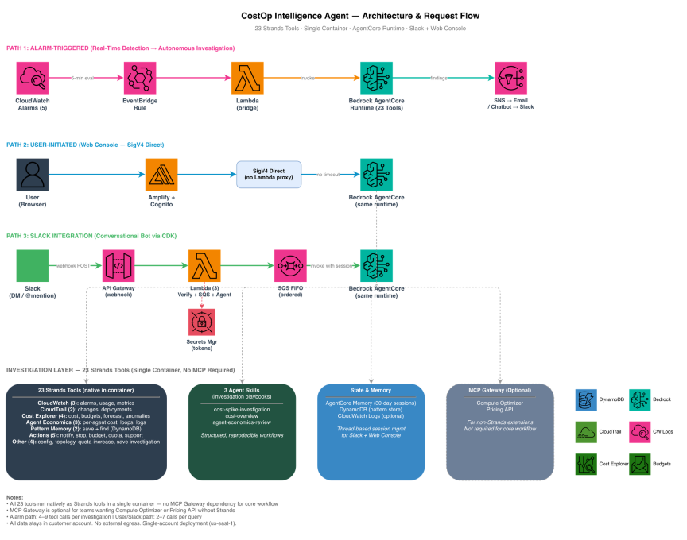

# Cost Intelligence Agent

> Autonomous cost governance, invocation monitoring, and CloudWatch-driven alerting for Amazon Bedrock — powered by prompt-engineered investigation workflows.

Built on Amazon Bedrock AgentCore + Strands SDK + Claude Sonnet 4.6.


---

## 🚀 First Time Setup (5 minutes)

### Prerequisites
- AWS account with Bedrock access (Claude Sonnet 4.6 enabled in your region)
- AWS CLI configured (`aws configure`)

### Step 1: Download the template

```bash
curl -O https://raw.githubusercontent.com/amitml/cost-intelligence-agent/main/cloudformation/costop-template.yaml
```

### Step 2: Deploy

```bash
aws cloudformation create-stack \
  --stack-name CostOp \
  --template-body file://costop-template.yaml \
  --parameters ParameterKey=AdminEmail,ParameterValue=YOUR_EMAIL@company.com \
  --capabilities CAPABILITY_NAMED_IAM \
  --region us-east-1
```

### Step 3: Wait ~5 minutes

```bash
aws cloudformation wait stack-create-complete --stack-name CostOp --region us-east-1
```

### Step 4: Get your URL and login

```bash
aws cloudformation describe-stacks --stack-name CostOp --region us-east-1 \
  --query 'Stacks[0].Outputs[?OutputKey==`WebAppURL`].OutputValue' --output text
```

- Check your email for temporary password from Cognito
- Login with username `admin` and the temp password
- Set a new password when prompted

---

## What It Does

```
Bedrock workload runs → Agent monitors continuously →
Alerts you with: WHO triggered it, WHAT happened, HOW MUCH it cost, and HOW TO FIX
```

### Core Capabilities

| Capability | Description |
|---|---|
| 💰 **Cost Governance** | Per-model and per-agent spend tracking, budget enforcement, anomaly detection |
| 📊 **Invocation Monitoring** | Token usage patterns, throttling events, model call frequency analysis |
| 🚨 **CloudWatch Alerting** | 5 preconfigured alarms with autonomous investigation on trigger |
| 🧠 **Prompt-Engineered Workflows** | Structured hypothesis-driven investigation, evidence ledger, and adaptive response generation |

### Key Features

- **Real-time detection** — CloudWatch alarms monitor Bedrock metrics continuously
- **Autonomous investigation** — prompt-engineered reasoning chains with evidence ledger
- **Structured reports** — findings tiles, timeline, action buttons
- **Pattern memory** — learns from past incidents, recognizes repeats
- **Proactive alerts** — email + Slack with full investigation (not just "alarm fired")
- **Dark mode** — full dark/light theme support

---

## Architecture



```
Web UI (Amplify) → Cognito Auth → AgentCore Runtime (11 tools)
                                        ↓
                    CloudWatch + CloudTrail + Cost Explorer + Invocation Logs
                                        ↓
                    Prompt-engineered investigation → Email + Slack + DynamoDB

Proactive: Alarm → EventBridge → Lambda → Agent → Email/Slack
```

---

## Configuration Options

Deploy with custom parameters:

```bash
aws cloudformation create-stack \
  --stack-name CostOp \
  --template-body file://costop-template.yaml \
  --parameters \
    ParameterKey=AdminEmail,ParameterValue=you@company.com \
    ParameterKey=DefaultModel,ParameterValue=Haiku4.5 \
    ParameterKey=MonthlyBudgetLimit,ParameterValue=200 \
    ParameterKey=EnableSlack,ParameterValue=Yes \
    ParameterKey=SlackBotToken,ParameterValue=xoxb-... \
    ParameterKey=MemoryRetentionDays,ParameterValue=90 \
  --capabilities CAPABILITY_NAMED_IAM \
  --region us-east-1
```

### Custom Model

Use any Bedrock model by setting `CustomModelId`:

```bash
ParameterKey=CustomModelId,ParameterValue=us.anthropic.claude-sonnet-4-20250514-v1:0
```

See [cloudformation/README.md](cloudformation/README.md) for all parameters.

---

## Cost to Run

| Model | Per Investigation |
|---|---|
| Sonnet 4.6 | ~$0.25 |
| Sonnet 4.5 | ~$0.25 |
| Haiku 4.5 | ~$0.03 |

Monthly cost depends on alarm frequency and investigation count. Infrastructure (alarms, DynamoDB, Lambda) is free tier or negligible.

---

## Delete Everything

```bash
aws ecr delete-repository --repository-name $(aws ecr describe-repositories --query 'repositories[?contains(repositoryName, `costop`)].repositoryName' --output text) --force --region us-east-1
aws cloudformation delete-stack --stack-name CostOp --region us-east-1
```

---

## Troubleshooting

| Issue | Fix |
|---|---|
| "Incorrect username or password" | Reset: `aws cognito-idp admin-set-user-password --user-pool-id <ID> --username admin --password 'NewPass1!' --permanent` |
| Agent returns error | Check logs: CloudWatch → `/aws/bedrock-agentcore/runtimes/` |
| Stack delete fails | Delete ECR repo first (see Delete section above) |

---

## Links

- [Full deployment guide](cloudformation/README.md)
- [ECR Public Image](https://gallery.ecr.aws/y3a7j1y9/amitml/costop-agent)

---

*Created by [amitml](https://github.com/amitml)*
